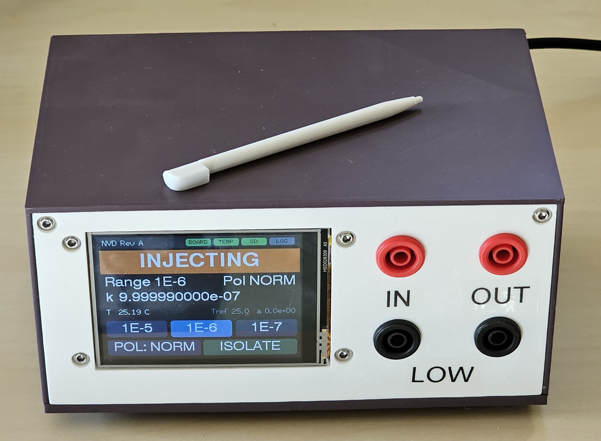
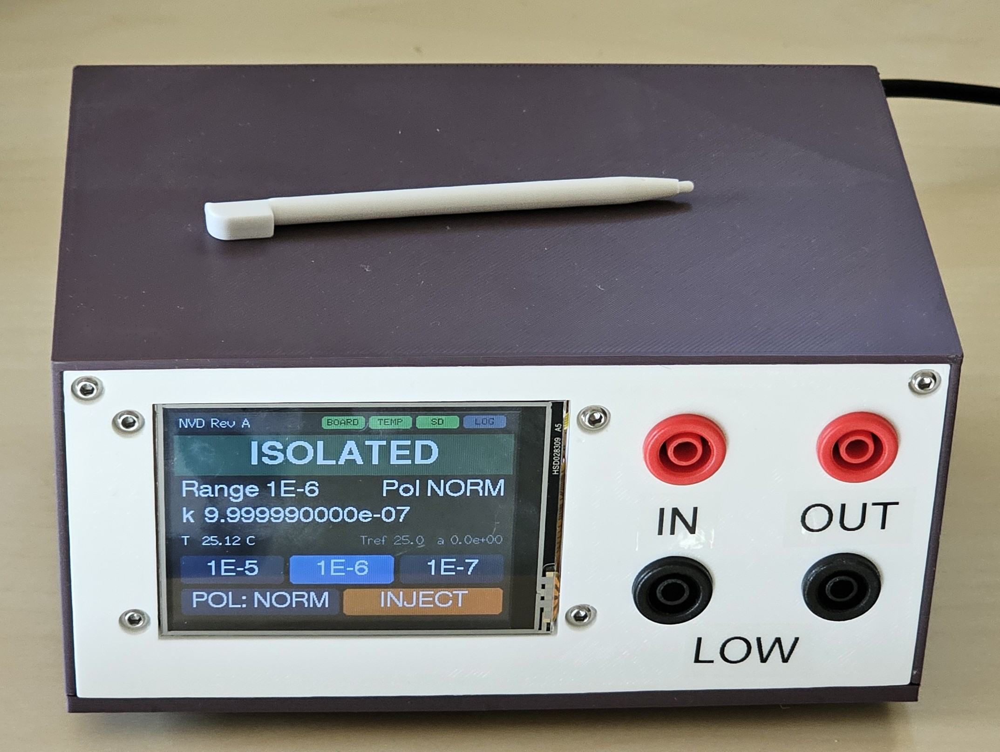
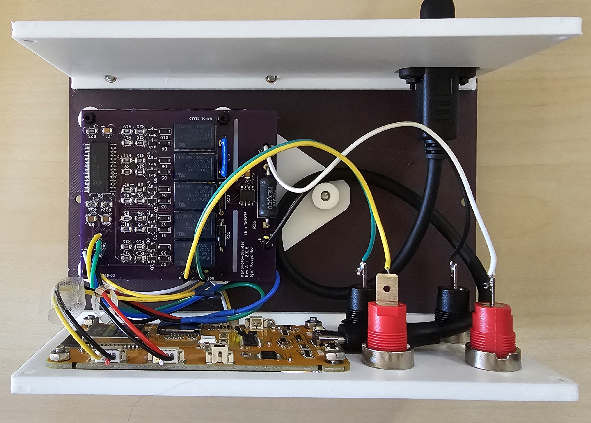
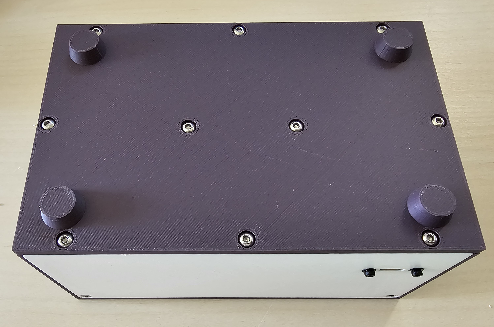

# nanovolt-divider

A programmable precision attenuator for nanovolt-to-microvolt experiments: it divides an ordinary
bench power supply down by **passive resistive division**, read by an external precision DMM. Three
ratios (1e-5, 1e-6, 1e-7), relay-controlled polarity reversal for ABBA modulation, and a
source-disconnected baseline that opens the source without touching the measurement path.
Calibration is in progress (see [Status](#status)).

| | |
|---|---|
|  |  |
| INJECTING: K5 set, the source drives the 1E-6 divider | ISOLATED: the source is open at both ends, the 1 Ω and OUT jacks stay connected |

| | |
|---|---|
| Ranges | `1E-5`, `1E-6`, `1E-7`: high legs of 100 kΩ (0.1 %, 5 ppm/°C), 1 MΩ (0.1 %, 10 ppm/°C) and 10 MΩ (1 %) over one shared 1 Ω low leg |
| Polarity | K4 reverses the source *upstream* of the high leg, so relay-contact EMFs reach the output divided by ~1/k |
| Baseline | ISOLATE opens the source at both ends; the 1 Ω, its Kelvin taps and the DMM path are never switched |
| Switching | Five latching relays, pulsed for 20 ms and never held: no continuous coil power |
| Temperature | TMP275 on a slotted island next to the 1 Ω |
| Calibration | Per-range k(T) = k0 [1 + α(T−T0) + β(T−T0)²] with uncertainties, stored in NVS and backed up to microSD |
| Control | SCPI over USB serial, and a 2.8" touchscreen (ESP32 "Cheap Yellow Display") |

## Status

Rev A is built and verified: all relay transitions work, and with 10 V applied all three ratios read
within 0.25 % of nominal, with the ISOLATE reading unchanged by the source. Firmware is 0.2.0.

**Calibration is in progress.** Until it completes, the instrument carries nominal ratios with
tolerance-sized uncertainties. The method, and each result as it comes in, are in
[docs/calibration.md](docs/calibration.md).

## Documentation

| Document | Contents |
|---|---|
| [docs/nanovolt_divider_rev_a.md](docs/nanovolt_divider_rev_a.md) | Design: architecture, relay rules, control, calibration model, BOM |
| [docs/hardware.md](docs/hardware.md) | Circuit, relay states, display harness wiring, board layout and routing rules |
| [docs/development.md](docs/development.md) | Opening the KiCad project, the ERC/DRC baseline, the generators and router, fabrication files |
| [docs/host_interface.md](docs/host_interface.md) | Driving it from a computer: the USB link, the reset-on-open trap, the SCPI contract |
| [docs/calibration.md](docs/calibration.md) | How the ratios are calibrated, the uncertainty budget, and the results so far |
| [firmware/README.md](firmware/README.md) | Building and flashing, the full SCPI command reference, first power-on |

## Repository layout

```
docs/                      design, hardware, development, host interface, calibration
calibration/               calibration result data (summaries and figures)
enclosure/                 SOLIDWORKS parts (.SLDPRT), STEP, and 3D-print files (.3MF, .3DXML)
firmware/                  ESP32 firmware, PlatformIO: relay state machine, SCPI over USB, touch UI,
                           microSD calibration backup and run log
hardware/                  KiCad 10 project
  nanovolt-divider.kicad_pro
  nanovolt-divider.kicad_sch   root sheet: metrology topology (input, relays, high legs, 1 ohm, output)
  control.kicad_sch            ESP32 display-module harness, MCP23017, TMP275, power
  relay_channel.kicad_sch      generic latching-relay channel, instantiated 5x (K1..K5)
  nanovolt-divider.kicad_pcb   board: 60 x 69.1 mm, 2 layers
  nanovolt-divider.kicad_dru   custom DRC rules (1 ohm bridge track width)
  lib/                         project symbol and footprint libraries
  fab/                         Rev A Gerbers and drill files
tools/gen_schematics.py    generates the schematics and the project libraries
tools/gen_pcb.py           generates the placed, unrouted board
tools/route_pcb.py         grid maze router around the hand routes (see docs/hardware.md)
tools/route_hand.py        the hand routes and routing policy: the design intent of the routing
tools/pcb_io.py            pcbnew side of the router: dump pads, apply routes
tools/scpi.py              SCPI terminal for the instrument over USB serial (uv run tools/scpi.py)
```

## Building one

1. **Boards.** Zip the contents of `hardware/fab/` and order (they went to OSH Park). Everything is
   hand-solderable; the BOM is in [§11 of the design doc](docs/nanovolt_divider_rev_a.md#11-bom).
2. **Harness.** Wire the display module to `J7` / `J8` **by signal name, never by pad number**: the
   board silk does not match the module. The table is in
   [docs/hardware.md, Display harness](docs/hardware.md#display-harness).
3. **Enclosure.** Print and assemble it as below.
4. **Firmware.** Build, flash and power on following [firmware/README.md](firmware/README.md).

## Enclosure

The enclosure is 3D-printed. `enclosure/` has the SOLIDWORKS source (`.SLDPRT`), a neutral `.STEP`
and a print-ready `.3MF` for each part: front panel (it also serves as the display bezel), back
panel, base plate (v1), cover (v1), PCB holder, and a wrench for the banana-jack nuts. The version
is in each file name.

Every part prints in PLA on a Prusa i3 MK3S with a 0.4 mm nozzle, using PrusaSlicer's
**0.20 mm QUALITY** preset, 15 % infill, and **no supports**.

Before assembling, heat-set the knurled brass inserts: the M2 ones go into the PCB holder, the M3
ones into the enclosure parts. Fasteners, banana jacks, the display module, and the cables are
listed in [BOM §11.4 and §11.5](docs/nanovolt_divider_rev_a.md#114-front-panel--mechanical).

| | |
|---|---|
|  |  |
| Cover off: the board on its holder, the display behind the front panel, and the jacks wired to their pads | Base plate with printed feet, and the back panel with the USB opening |

## Known limitations

* The board's harness silk and F.Fab text describe a different module pinout from the module the
  instrument uses. Wire by signal name (see
  [Display harness](docs/hardware.md#display-harness)).
* The harness cable has no strain relief at the board end; nothing on the board takes that load.

## Datasheets

Not redistributed here. Panasonic TQ relays: catalog ASCTB14E (`industry.panasonic.com`); Ohmite
MOX-700 and Slim-Mox; Vishay Dale RS/NS; Microchip MCP23017; TI TMP275.

## License

* Hardware (`hardware/`), enclosure (`enclosure/`) and documentation (`docs/`, `calibration/`):
  [CERN-OHL-P-2.0](LICENSE-CERN-OHL-P-2.0).
* Firmware (`firmware/`) and tools (`tools/`): [MIT](LICENSE-MIT).

Source location: <https://github.com/kuvychko/nanovolt-divider>. See [LICENSE](LICENSE).
