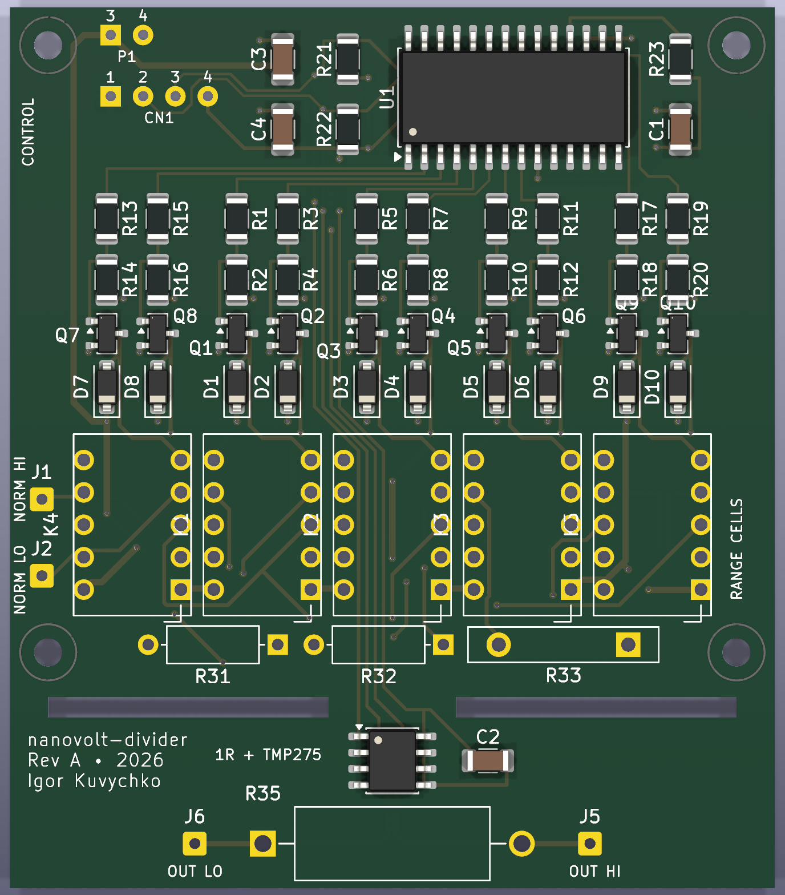

# nanovolt-divider

A programmable precision attenuator that turns an ordinary bench power supply into a calibrated
nanovolt-to-microvolt source by **passive resistive division**, read by an external precision DMM.
Three ratios (1e-5, 1e-6, 1e-7), relay-controlled polarity reversal for ABBA modulation, and a true
zero that disconnects the source without touching the measurement path.



| | |
|---|---|
| Ranges | `1E-5`, `1E-6`, `1E-7`: high legs of 100 kΩ (0.1 %, 5 ppm/°C), 1 MΩ (0.1 %, 10 ppm/°C) and 10 MΩ (1 %) over one shared 1 Ω low leg |
| Polarity | K4 reverses the source *upstream* of the high leg, so relay-contact EMFs reach the output divided by ~1/k |
| Zero | ISOLATE opens the source at both ends; the 1 Ω, its Kelvin taps and the DMM path are never switched |
| Switching | Five latching relays, pulsed for 20 ms and never held: no coil heat while measuring |
| Temperature | TMP275 on a slotted island next to the 1 Ω |
| Calibration | Per-range k(T) = k0 [1 + α(T−T0) + β(T−T0)²] with uncertainties, stored in NVS and backed up to microSD |
| Control | SCPI over USB serial, and a 2.8" touchscreen (ESP32 "Cheap Yellow Display") |

## Status

Rev A is built and verified: all relay transitions work, and with 10 V applied all three ratios read
within 0.25 % of nominal, with the ISOLATE reading unchanged by the source. Firmware is 0.2.0.

**Calibration is in progress.** Until it completes, the instrument carries nominal ratios with
tolerance-sized uncertainties. The method, and each result as it comes in, are in
[docs/calibration.md](docs/calibration.md).

## Documentation

| Document | Contents |
|---|---|
| [docs/nanovolt_divider_rev_a.md](docs/nanovolt_divider_rev_a.md) | Design: architecture, relay rules, control, calibration model, BOM |
| [docs/host_interface.md](docs/host_interface.md) | Driving it from a computer: the USB link, the reset-on-open trap, the SCPI contract |
| [docs/calibration.md](docs/calibration.md) | How the ratios are calibrated, the uncertainty budget, and the results so far |
| [firmware/README.md](firmware/README.md) | Building and flashing, the full SCPI command reference, first power-on |

## Repository layout

```
docs/                      design, host interface, calibration
calibration/               calibration result data (summaries and figures)
enclosure/                 SOLIDWORKS parts (.SLDPRT), STEP, and 3D-print files (.3MF, .3DXML)
firmware/                  ESP32 firmware, PlatformIO: relay state machine, SCPI over USB, touch UI,
                           microSD calibration backup and run log
hardware/                  KiCad 10 project
  nanovolt-divider.kicad_pro
  nanovolt-divider.kicad_sch   root sheet: metrology topology (input, relays, high legs, 1 ohm, output)
  control.kicad_sch            ESP32 display-module harness, MCP23017, TMP275, power
  relay_channel.kicad_sch      generic latching-relay channel, instantiated 5x (K1..K5)
  nanovolt-divider.kicad_pcb   board: 60 x 69.1 mm, 2 layers
  nanovolt-divider.kicad_dru   custom DRC rules (1 ohm bridge track width)
  lib/                         project symbol and footprint libraries
  fab/                         Rev A Gerbers and drill files
tools/gen_schematics.py    generates the schematics and the project libraries
tools/gen_pcb.py           generates the placed, unrouted board
tools/route_pcb.py         grid maze router around the hand routes (see Routing)
tools/route_hand.py        the hand routes and routing policy: the design intent of the routing
tools/pcb_io.py            pcbnew side of the router: dump pads, apply routes
tools/scpi.py              SCPI terminal for the instrument over USB serial (uv run tools/scpi.py)
```

## Circuit

### Hierarchy

```
nanovolt-divider.kicad_sch (root)
+-- CONTROL          control.kicad_sch
+-- RANGE_1E5 (K1)   relay_channel.kicad_sch
+-- RANGE_1E6 (K2)   relay_channel.kicad_sch
+-- RANGE_1E7 (K3)   relay_channel.kicad_sch
+-- POLARITY  (K4)   relay_channel.kicad_sch
+-- INJECT    (K5)   relay_channel.kicad_sch
```

`relay_channel.kicad_sch` exposes `SET`, `RESET`, `A_COM`, `A_NC`, `A_NO`, `B_COM`, `B_NC`, `B_NO`.
Each instance contains one Panasonic TQ2-L2-5V (2-coil latching DPDT) and two MMBT2222A low-side
coil drivers with 1N4148W flyback diodes.

### Relay states

| Relay | RESET (NC) | SET (NO) |
|---|---|---|
| K4 POLARITY | normal (`SRC_P` = `NORMAL_IN_P`) | inverted |
| K1..K3 RANGE | open at both ends | range active (only one at a time) |
| K5 INJECT | ISOLATE - both legs open (1 ohm and DMM path untouched) | INJECT |

K1..K3 use **both** poles of their relay: pole A breaks the top of the high leg (`R*_IN`), pole B
breaks the bottom (`R*_OUT`). A deselected resistor is therefore isolated at both ends and never
loads `RANGE_BUS`, which matters most on the 10 M range.

K5 does the same for the source as a whole: pole A breaks the high side (`RANGE_BUS` -> `MEAS_NODE`)
and pole B breaks the return (`SRC_RTN` -> `ANALOG_RTN`). In ISOLATE the source is disconnected
from the 1 ohm and the DMM path at both ends, so nothing of it - not its output capacitance, not its
leakage to earth - remains attached to the measurement node.

### Control wiring

* Controller: a 2.8" ESP32 touch-TFT module, a "Cheap Yellow Display" (ESP32-2432S028R family),
  mounted off-board and connected by three of its own pigtails (see Display harness).
* The pigtails are **soldered** to pads at the board end; the module end keeps its connector, so
  the display still unplugs. The panel jacks (`J1`, `J2`, `J5`, `J6`) are hard-wired the same way.
* Only the six live conductors have pads: `J7` (5 V, GND) and `J8` (GND, SCL, SDA, 3V3). Both GND
  wires are run: `J7`'s returns the pulsed coil current and `J8`'s serves I2C. They are the same
  net, but two conductors cut the shared IR drop in the cable. Do not collapse them to one wire.
* MCP23017 (I2C 0x20) drives the ten coil lines: GPB0..GPB7 = K4 SET, K4 RESET, K1 SET, K1 RESET,
  K2 SET, K2 RESET, K3 SET, K3 RESET; GPA0 = K5 RESET, GPA1 = K5 SET; GPA2..GPA7 spare. The order
  follows the board: in the driver columns' left-to-right order the lines fan out without a
  crossing or a via. The firmware maps GPIO to coil by table.
* TMP275 (I2C 0x48, `A2:A0` all on `DGND`) sits next to the 1 ohm resistor, thermal proximity only.
  It tracks the *change* in the 1 ohm region's temperature for the ratio correction, which needs
  short-term repeatability (12-bit, 0.0625 C) rather than absolute accuracy (+/-0.5 C). SOIC-8, so the
  whole board can be hand-soldered.
* The control ground is the global net `DGND`, deliberately not `GND`, so it cannot be merged with
  the floating analog return (`SRC_RTN` / `ANALOG_RTN`) by accident.

### Display harness

The module has three 4-pin connectors:

| Module connector | Signals, in the order printed on the module |
|---|---|
| UART / power | RXD, TXD, GND, 5V |
| 3V3 | 3.3V, IO35, *(nc)*, GND |
| SPI | IO23 (MOSI), IO19 (MISO), IO18 (SCK), IO27 (CS) |

Wire them to the board like this:

| Board pad | Net | Wire from module | Pad silk |
|---|---|---|---|
| `J7` pad 3 | `+5V` | UART / power: **5V** | `P1` `3` |
| `J7` pad 4 | `DGND` | UART / power: **GND** | `P1` `4` |
| `J8` pad 1 | `DGND` | 3V3: **GND** | `CN1` `1` |
| `J8` pad 2 | `SCL` | SPI: **IO18** | `CN1` `2` |
| `J8` pad 3 | `SDA` | SPI: **IO27** | `CN1` `3` |
| `J8` pad 4 | `+3V3` | 3V3: **3.3V** | `CN1` `4` |
| - | - | cut back and insulate: RXD, TXD, IO35, the nc pin, IO23, IO19 | - |

* **Land every wire by signal name, never by pad number.** The silk numbers on the board do not
  match this module: on `J7`, module pin 3 is GND but pad `3` is `+5V`, so matching numbers would
  feed the coil drivers a reversed 5 V supply. The `J8` pad row is fed by two different pigtails, so
  its "CN1 1-4" silk refers to no single connector. The F.Fab text on the board (`SCL_IO22`,
  `VIN_5V`) does not match either. The schematic symbols carry the correct module labels.
* **Why IO18 / IO27.** I2C needs two pins that can drive open-drain. IO35 cannot (ESP32 GPIO34-39
  are input-only), and RXD / TXD carry the USB-serial SCPI interface, which leaves the SPI
  connector. Firmware: `Wire.begin(/*SDA*/ 27, /*SCL*/ 18)`.
* **IO18 is shared with the microSD slot** (its SCK; the slot has its own CS on IO5). With the card's
  CS deasserted, I2C traffic on IO18 does not disturb it; the firmware switches IO18 between I2C and
  SPI around each card access (see `firmware/README.md`). The module has no pull-ups on IO18 or IO27,
  so `R21` / `R22` set the bus pull-up.
* Both GND conductors run from different connectors: the UART / power GND to `J7` (coil current) and
  the 3V3 connector's GND to `J8` (I2C).

## Board

* 60 x 69.1 mm, two layers, laid out top-down: one control band, ten coil-driver columns, the five
  relays, then the three high legs flat in one row.
* **The control band is a single row**: `[H1] P1/CN1 | C3,C4 | R21,R22 | U1 | R23,C1 [H2]`. The bulk
  caps sit at the power entry, the I2C pull-ups between the harness and `U1` so the bus runs left to
  right, and `C1` beside `U1`'s power pins.
* **Driver cells.** Each relay carries its SET/RESET driver pair directly above it, so `RANGE_BUS`
  runs as one short chain across the three range cells.
* **The three high legs lie flat in one row** under the relays. `A_NO` and `B_NO` are both on each
  relay's upper contact row, and the flat, offset placement keeps both runs to 2-5 mm.
* **M2 mounting holes.** The smaller courtyard lets the holes sit closer to `K4`/`K5` above and the
  slots below, which saves board height.
* The relay coils are pulsed for 20 ms and never held, so their average dissipation is ~0 and they
  can sit next to the range resistors. The continuously powered parts (MCP23017, harness pads, bulk
  caps) stay at the top edge, away from `MEAS_NODE`.
* **The 1 ohm island.** Two slots leave a 10 mm centre bridge and 3 mm bridges at both board edges
  for stiffness; `MEAS_NODE`, `ANALOG_RTN` and the TMP275 lines cross the centre one. The OUT HI / OUT
  LO wire pads are at the resistor's own terminals. Both lower mounting holes sit *above* the slots:
  a screw on the island would add a thermal and mechanical-stress path to the precision resistor.
* The TMP275 sits on the island above `R35`. What couples the sensor to `R35` is the island copper,
  not the air over the body.
* **`J1` / `J2` sit beside `K4`**, opposite the K4 pole-B contacts they wire to, clear of the lower
  left mounting hole.
* `DGND` pour on B.Cu covers the digital circuitry (control cluster and coil drivers). The only
  copper keepout is over the 1 ohm island.
* Panel parts (four banana jacks) terminate on solder-wire pads. Nothing is wired panel-to-panel,
  so every conductor appears in the netlist.

### Routing

The precision path, the driver cells and the whole control band are hand-laid
(`tools/route_hand.py`); a grid maze router (`tools/route_pcb.py`) filled in the rest around them.
Rules the routing follows, and that hand edits should keep:

* **`MEAS_NODE` and `ANALOG_RTN` run as one tight pair on B.Cu** from K5 to R35: 0.4 mm, 0.3 mm
  apart, via-free. `ANALOG_RTN` is on the side facing the high-leg pads, so it rather than
  `MEAS_NODE` takes any surface leakage from `R*_IN`. The pair crosses the centre bridge on the
  board's centre line and only splits under R35, along its axis, so the current loop is the
  resistor itself and both terminals have the same copper path back to the board.
* **Kelvin at R35.** The injection current lands on R35's pads from the inside; J5 / J6 (the DMM)
  leave them on the outside on F.Cu, and carry no current.
* **Source-side and low-side copper keep 0.5 mm apart on the same layer.** `SRC_P`, `NORMAL_IN_*`
  and `R*_IN` sit at the source voltage; `RANGE_BUS`, `R*_OUT` and `MEAS_NODE` at the bottom of the
  selected high leg. Leakage between them is a resistor across the high leg - 10 ppm at 1e12 ohm on
  the 10 M range. Where the two chains must cross they do it on opposite layers, through 1.6 mm of
  FR4 bulk. `SRC_RTN` / `ANALOG_RTN` are in neither class: leakage into them only loads the source.
* **Nothing reaches the 1 ohm island except over the centre bridge**, and the bridge carries no
  vias. A track over an edge bridge would bring heat in at one end of R35, and a temperature
  difference between its terminals is a thermal EMF in series with the measurement.
* **The TMP275 lines are one F.Cu spine**: SDA, SCL, DGND, +3V3 at 0.65 mm pitch, down the gap
  between the K1 and K2 driver pairs, through the left half of K2, under R32's body and onto the
  island left of the pair. The precision chains cross it on B.Cu.
* **Driver cells are identical.** Each column is the same template: the base node runs straight
  from the 1k to the 10k, which is why R1-R20 sit at 270 degrees. DGND goes to the B.Cu pour through
  a via beside the 10k and one beside the emitter; cathodes drop to a +5V bus on B.Cu at y 32.5 along
  the bottom of the pour.
* **One coil crossing per relay, the same for all five.** The SET column feeds the right-hand coil
  pin and the RESET column the left: SET stays on F.Cu, RESET drops to B.Cu. That leaves the left
  half of each relay's top free on F.Cu, which is how the TMP275 spine gets into K2.
* **The MCP23017 fan-out has no crossings and no vias.** Eight lines drop off U1's lower row in the
  driver columns' order, five of them left in 0.2 mm lanes at 0.4 mm pitch, and K5's two leave under
  the package to the right. SDA, SCL and 3V3 reach U1 under its body, stacked in the order they drop
  to pins 13, 12 and 9.
* **The control band's vias are each unavoidable:** the TMP275 spine's SDA, SCL and 3V3 each rise on
  B.Cu past the coil lanes; R21's 3V3 pad is fenced in by SDA and SCL; and C1/R23 sit beyond the K5
  lines, so their 3V3 hops from pin 9 on B.Cu. SDA and SCL squeeze between C3 and C4 in two 0.2 mm
  lanes; +5V comes down the left edge from P1.

## Working with the design files

Open `hardware/nanovolt-divider.kicad_pro` in KiCad 10. The project library
`hardware/lib/nanovolt-divider.kicad_sym` holds the TQ2-L2-5V relay, the TMP275, the `DGND` power
symbol and the two ESP32 harness pigtail landings. These carry the module's own pin names
(`SCL_IO18`, `SDA_IO27`, ...) rather than `Pin_1..Pin_4`, so a wire on the wrong pin is visible in
the schematic. The harness footprints are kept exactly as fabricated (`HARNESS_PADS_REV_A` in
`gen_schematics.py`), which is why their F.Fab names differ; see Display harness. Footprints for the
relay, the precision resistors and the harness pads are in `hardware/lib/nanovolt-divider.pretty`;
the TMP275 uses the stock `Package_SO:SOIC-8_3.9x4.9mm_P1.27mm`. Everything else is stock KiCad.

ERC, DRC and exports from the command line:

```
kicad-cli sch erc --severity-all --exit-code-violations hardware/nanovolt-divider.kicad_sch
kicad-cli sch export pdf --output build/schematic.pdf hardware/nanovolt-divider.kicad_sch
kicad-cli pcb drc --severity-error --severity-warning hardware/nanovolt-divider.kicad_pcb
```

The baseline is ERC clean, and DRC 0 errors, 0 unconnected and 56 `silk_over_copper` warnings
(silkscreen clipped by solder mask at pad openings, which the fab does anyway). With
`--schematic-parity` there are also 2 `footprint_symbol_field_mismatch` warnings: the Description
field of `J7` and `J8` names the display module, while the board keeps the fabricated text. They
are metadata only. Check that a change does not add to this baseline.

### Generators

`tools/gen_schematics.py` generates all schematic files, the project symbol library and the project
footprints; re-run it after editing the script. It will **not** overwrite an existing
`nanovolt-divider.kicad_pro`, which KiCad owns and which holds the DRC severities. It writes its
files directly with derived UUIDs, so re-running it leaves the working tree clean.

`tools/gen_pcb.py` writes a placed, **unrouted** board from scratch, so running it discards the
routing and any hand edits. The router then reproduces the committed routing exactly (it deletes
every track before applying its own):

```
"C:/Program Files/KiCad/10.0/bin/python.exe" tools/pcb_io.py dump  hardware/nanovolt-divider.kicad_pcb %TEMP%/nvd_geom.json
uv run tools/route_pcb.py %TEMP%/nvd_geom.json %TEMP%/nvd_routes.json
"C:/Program Files/KiCad/10.0/bin/python.exe" tools/pcb_io.py apply hardware/nanovolt-divider.kicad_pcb %TEMP%/nvd_routes.json
```

**A regenerated board produces a large, meaningless diff.** `kicad-cli pcb upgrade` assigns fresh
random UUIDs to the graphics it materialises inside stock footprints, so about 683 of the board's
~1400 UUIDs change on every run, and `kicad-cli` writes CRLF while `.gitattributes` pins the repo to
LF. Neither is a real change. Before acting on a board diff, normalise both sides and compare:

```python
import re, io, subprocess
strip = lambda t: re.sub(r'"[0-9a-f]{8}-[0-9a-f]{4}-[0-9a-f]{4}-[0-9a-f]{4}-[0-9a-f]{12}"', '"U"',
                         t.replace("\r\n", "\n"))
cur  = io.open("hardware/nanovolt-divider.kicad_pcb", "rb").read().decode("utf-8")
head = subprocess.run(["git", "show", "HEAD:hardware/nanovolt-divider.kicad_pcb"],
                      capture_output=True).stdout.decode("utf-8")
print(strip(head) == strip(cur))    # True -> nothing changed; restore the file, do not commit it
```

Read both sides as bytes and decode UTF-8 explicitly. Decoding one side through
`subprocess.run(text=True)` uses the locale codec and manufactures fake differences around non-ASCII
characters - KiCad's stock `SolderWire` footprint description genuinely contains a U+FFFD.

What proves a board change is real is the exported netlist and an ERC/DRC comparison, not the
file diff.

## Fabrication files

`hardware/fab/` holds the Rev A Gerbers and drill files exactly as sent to the fab (OSH Park, git
tag `rev-a`). `.gitattributes` marks the folder `-text` so git leaves their CRLF line endings alone.
To order boards, zip the folder's contents. Two things to know about them:

* Their metadata says `Rev0` (`TF.ProjectId` in every Gerber, `Revision` in the job file). The
  copper is the Rev A board's: re-plotting the board and diffing against these files leaves only the
  creation date and the drill marks.
* They are plotted with drill marks **off**. The board file's stored plot settings have them on
  (small), so `kicad-cli pcb export gerbers --board-plot-params` adds a 0.3 / 0.35 mm flash at every
  hole on the copper and mask layers. Turn them off when re-plotting.

## Enclosure

The enclosure is 3D-printed. `enclosure/` has the SOLIDWORKS source (`.SLDPRT`), a neutral `.STEP`
and a print-ready `.3MF` for each part: front panel (it also serves as the display bezel), back
panel, base plate (v1), cover (v1), PCB holder, and a wrench for the banana-jack nuts. The version
is in each file name.

Every part prints in PLA on a Prusa i3 MK3S with a 0.4 mm nozzle, using PrusaSlicer's
**0.20 mm QUALITY** preset, 15 % infill, and **no supports**.

Before assembling, heat-set the knurled brass inserts: the M2 ones go into the PCB holder, the M3
ones into the enclosure parts. Fasteners, banana jacks, the display module, and the cables are
listed in [BOM §11.4 and §11.5](docs/nanovolt_divider_rev_a.md#114-front-panel--mechanical).

## Known limitations

* The board's harness silk and F.Fab text describe a different module pinout from the module the
  instrument uses. Wire by signal name (see Display harness).
* The harness cable has no strain relief at the board end; nothing on the board takes that load.

## Datasheets

Not redistributed here. Panasonic TQ relays: catalog ASCTB14E (`industry.panasonic.com`); Ohmite
MOX-700 and Slim-Mox; Vishay Dale RS/NS; Microchip MCP23017; TI TMP275.

## License

* Hardware (`hardware/`), enclosure (`enclosure/`) and documentation (`docs/`, `calibration/`):
  [CERN-OHL-P-2.0](LICENSE-CERN-OHL-P-2.0).
* Firmware (`firmware/`) and tools (`tools/`): [MIT](LICENSE-MIT).

Source location: <https://github.com/kuvychko/nanovolt-divider>. See [LICENSE](LICENSE).
