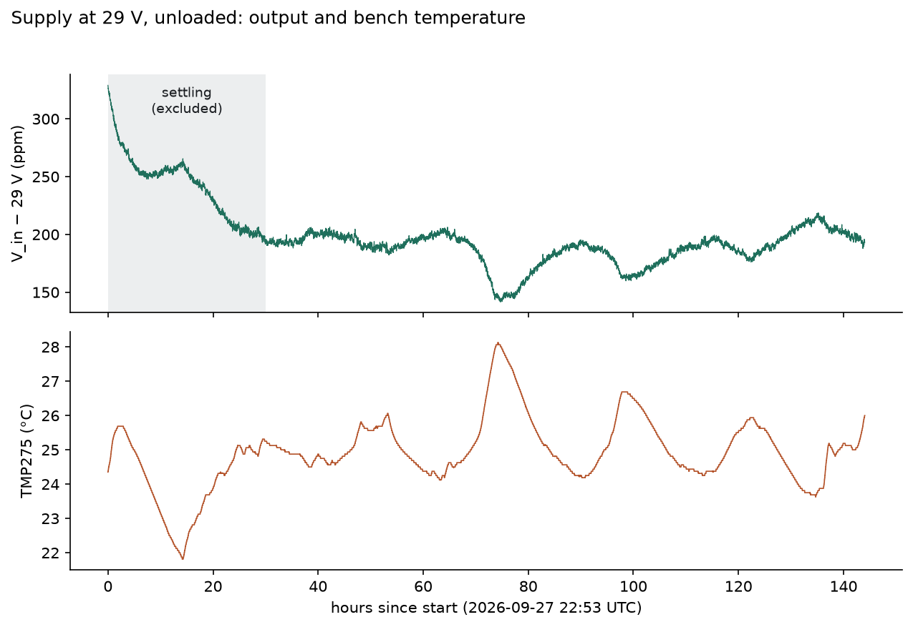
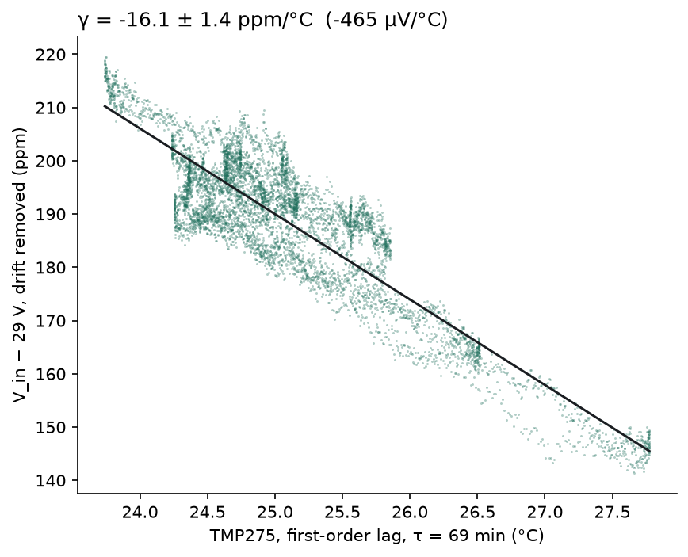
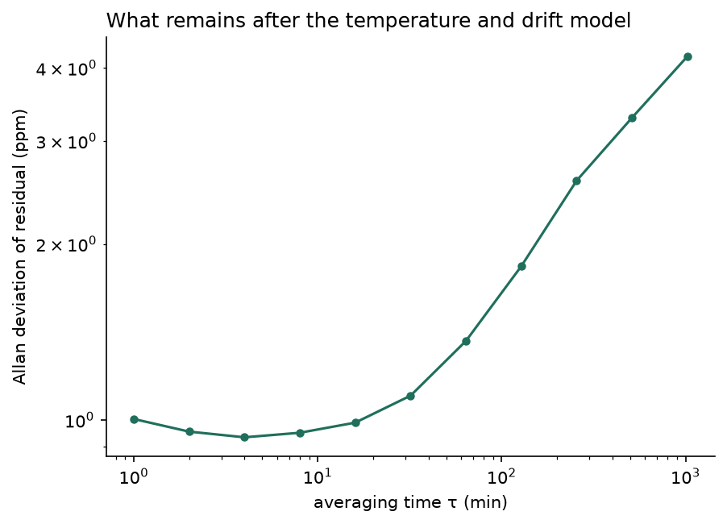

# Calibration

How the divider's three ratios, and their temperature dependence, are measured, how well, and how
the result is written into the instrument. Results are added here as each step completes, so the
page also serves as a reference for anyone building and calibrating their own.

**Status: in progress.** Until calibration completes, the instrument carries nominal records:
k0 = 1/(R_H + 1 Ω), no temperature correction, and u_k0 from the part tolerances (10050 / 10050 /
14142 ppm).

| Step | What it yields | Status |
|---|---|---|
| 1. [Supply characterisation](#1-supply-characterisation) | Supply tempco (as read by the meter), lag and drift; the residual the ratio run inherits | **Done** 2026-10-03, [result](#supply-characterisation-2026-09-27--10-03) |
| 2. [High legs by resistance](#2-high-legs-by-resistance) | R_total per range; the R_L consistency check | Pending (first attempt invalid: panel wiring) |
| 3. [Null tests](#3-null-tests) | Any signal produced by switching alone | Pending |
| 4. [Ratio run](#4-ratio-run) | k0 and α per range | Pending |
| 5. [End-to-end injection](#5-end-to-end-injection) | Acceptance: known nanovolt signals recovered | Pending |
| [Write-back](#write-back) | Records stored in the instrument | Pending |

## Equipment

* **Source:** a programmable bench supply (here a UNI-T UDP3305S-E, CH1), output on and constant for
  the whole of every run, current limit 10 mA. The divider draws at most 290 µA (29 V into 100 kΩ).
* **Meter:** one 5½-digit DMM (here an HP 3478A), DC volts, autozero on, a fixed range per run:
  **30 V** at the NORMAL IN jacks, **30 mV** at the OUT jacks.
* **Temperature:** the divider's own TMP275. The supply, meter and divider share a bench, so it is also
  the bench thermometer. There is no temperature chamber: temperature varies only with the room.
* **Host:** a computer logging every meter sample with a UTC timestamp, and every divider transition
  with the time it actually happened ([host_interface.md](host_interface.md)).

## What is calibrated

Per range i ∈ {1E-5, 1E-6, 1E-7}, the instrument stores (`CAL:REC`):

```
k_i(T) = k0_i · [1 + α_i (T − T0) + β_i (T − T0)²]        valid for Tmin ≤ T ≤ Tmax
```

* **T is the TMP275 reading,** not room temperature and not a resistor's own temperature. The sensor
  sits on the slotted 1 Ω island next to R35, so it tracks the low leg closely. The high legs sit off
  the island and see the room through a different thermal path, so their lag relative to the TMP275
  is fitted, not assumed zero.
* **Decomposition.** k = R_L/(R_H + R_L) and R_L/R_H ≤ 1e-5, so to better than 0.1 ppm
  **α_i = α_L − α_H,i**. α_L (the 1 Ω) is common to all three ranges; α_H,i belongs to each high leg.
* **β** stays 0 unless the observed span resolves curvature. **[Tmin, Tmax]** is the TMP275 span
  actually observed. Outside it, `CAL:FACT?` still answers but reports `in_span=0`.
* Stored with each record: `u_k0_ppm` and `u_alpha_ppm` (standard uncertainties, k = 1), a date, and
  a `source` string identifying the calibration.

## Method

* **Modulate, using ABBA.** A 3478A's zero sits near −2 µV and wanders by hundreds of nV over minutes.
  Every output measurement is the difference of polarity-reversed dwells ordered N-I-I-N, which
  cancels offset, thermal EMF and linear drift. Per block, S = (N₁ + N₂ − I₁ − I₂)/4.
* **Reverse inside the divider, never at the source.** K4 sits upstream of the high leg, so any
  thermal EMF of K4, K5 or the range-relay contacts is in series with R_H and reaches the output
  divided by ~1/k: at 1E-5, a 1 µV contact EMF becomes 10 pV. Switching the supply's own output
  relay would add an EMF that switches in step with the signal.
* **60 s dwells, first 2 s dropped.** With this meter, the Allan deviation times √τ is flat below
  about 30 s, so 60 s dwells lose nothing per unit time and keep ABBA's linear-drift assumption
  honest. The sample straddling a switch is discarded, and so is the next.
* **Fixed meter ranges** for a whole run, and **UTC timestamps** throughout. `SYST:TIME` is set on the
  divider at every connect, and `SYST:BOOT:COUNT?` is checked every 10 s.
* **The supply stays on between steps.** After switch-on its output settles over about a day; turning
  it off between steps would restart that.
* **V_cal = 29 V.** The statistical error falls as 1/V, and 29 V leaves headroom at the top of the
  meter's 30 V range for the supply's few-mV positive offset.

## Procedure

### 1. Supply characterisation

The divider isolated with no range selected, so the supply is unloaded and the divider dissipates
nothing. The meter on NORMAL IN, 30 V range, supply at 29 V, for 144 h. Fit
V_in = V0 · [1 + γ (T_lagged − T_ref) + δ·t] against the TMP275: γ is the tempco of the supply as
read by the meter on its 30 V range, δ its drift, plus a fitted lag. The meter sits on the same bench,
so its own 30 V tempco is folded into γ; nothing here separates the two. The residual scatter is the supply's short-term noise, which the ratio run
inherits.

The drop between the supply and the IN jacks under the divider's load (0.5–2 ppm on 1E-5) is not
seen here. The ratio run's anchors on IN, taken under load, carry it.

### 2. High legs by resistance

The supply unplugged from NORMAL IN (left on, unloaded), OUT open, and the meter measuring 2-wire
resistance across NORMAL IN while the divider injects on each range in turn. The meter's ohms range
follows the divider: 300 kΩ, 3 MΩ, 30 MΩ. Each range is measured N, I, I, N, so a thermal EMF in the
path shows as R(N) ≠ R(I) and cancels in the mean. About 3 h.

This reads R_total,i = R_H,i + R_L + contacts + leads. 2-wire is enough: 0.5 Ω of leads is 5 ppm of
100 kΩ, below the meter's ohms accuracy. Combined with the ratio run, R_L,i = k_i · R_total,i must
agree across the three ranges, because R_L is one physical part:

| If this disagrees | Likely cause |
|---|---|
| 1E-7 against the other two | leakage across the 10 MΩ leg, or the meter's 30 MΩ range |
| any one range | a contact or wiring fault on that range |
| all three by the same factor | the meter's volts against its ohms |

### 3. Null tests

The ratio-run schedule with nothing to measure, the meter on OUT on its 30 mV range, about 24–30 h
across three variants:

| Variant | Source | Divider | A signal would mean |
|---|---|---|---|
| a | 29 V applied | ISOLATE, K4 still switching | coil pulses, display or USB traffic couple into OUT |
| b | copper link across NORMAL IN | INJECT | the switched path itself produces an offset |
| c | supply connected at 0 V | INJECT | the real source, at zero, is not a zero |

A nanovolt-level bias matters very differently by range: 2 nV is 7 ppm of the 1E-5 signal at 29 V,
70 ppm of 1E-6 and 700 ppm of 1E-7. A bias found here is corrected for in the ratio run.

### 4. Ratio run

The meter on OUT, 30 mV range, supply at 29 V, for 72 h. One cycle, repeated:

```
for range in 1E-5, 1E-6, 1E-7:
    RANG range; OUTP ON
    ABBA block: POL NORM 60 s, POL INV 60 s, POL INV 60 s, POL NORM 60 s
OUTP OFF: ISOLATE dwell 60 s                  (offset / leakage diagnostic)
```

A cycle takes 13 min, about 330 blocks per range in 72 h. k_i(t) = S / V_in(t), with V_in from the
supply model of step 1, pinned by **anchors**: the meter moved to IN (30 V range) under load for
15 min before and after the run. The anchors set the absolute level; the model supplies the shape.
k_i is then fitted against the TMP275 with a first-order lag, giving k0_i and α_i (and β_i only if
significant).

The ratios k_5/k_6 and k_6/k_7 come free from the same blocks. They cancel the common supply level,
and their temperature dependence is α_H,6 − α_H,5 (and α_H,7 − α_H,6), without needing the supply
model. They do not cancel supply variation entirely: the ranges are measured one after another, 4 min
apart, so the supply's movement between those windows stays in each ratio. Step 1's Allan deviation
puts that near 1 ppm per cycle, averaging down over ~330 cycles, far below the 50 and 500 ppm
statistical limits of 1E-6 and 1E-7.

Each range carries current only 4 minutes in every 13. Self-heating with a time constant of minutes
would show as N₁ ≠ N₂ curvature within blocks, which ABBA does not cancel; it is checked for and
modelled if present.

### 5. End-to-end injection

With the calibrated factors stored, inject known signals of 10–100 nV through the divider and recover
them by the same ABBA method. This tests the divider at its actual job.

## Uncertainty

With ABBA blocks of 60 s dwells on the 3478A's 30 mV range scattering by about 26 nV, and ~330 blocks
per range at 29 V, the statistical limits on k0 are roughly:

| | 1E-5 | 1E-6 | 1E-7 |
|---|---|---|---|
| Signal at 29 V | 290 µV | 29 µV | 2.9 µV |
| k0, statistical | 5 ppm | 50 ppm | 500 ppm |

Statistical and bounded systematic terms are combined; terms nothing here can bound are reported
separately:

| Term | Kind | Bounded by |
|---|---|---|
| ABBA scatter | statistical | Scatter of independent sub-runs (not the fit's formal error). |
| Supply model residual; anchor mismatch before vs after | systematic | Step 1 residuals, the two anchors. |
| Lag / hysteresis (warming vs cooling fits) | systematic | Separate fits on warming and cooling segments. |
| TMP275 quantisation (0.0625 °C) | systematic | Its effect on the fitted α. |
| Switching bias | systematic | Step 3. |
| **Meter range-to-range gain, 30 V vs 30 mV** | **unbounded here** | Enters k0 directly, at the meter's accuracy-spec level (hundreds of ppm). Only a second meter or a reference can close it. |
| Meter input-attenuator tempco (30 V range only) | unbounded here | Does not cancel between steps 1 and 4. A few ppm/°C at most. |
| Sensor-to-leg gain mismatch (high legs off the island) | unbounded here | The range-ratio temperature dependence constrains it. |

**Realistic outcome.** k0 is limited by the meter's range-to-range accuracy rather than by statistics,
except perhaps on 1E-7. α resolves on 1E-5 (a few ppm/°C). On 1E-6 and 1E-7 the natural temperature
swing does not resolve α, and it stays at the part tolerances; within a few °C of T0 that
contributes less than those ranges' statistical limits.

## Write-back

Once the analysis is reviewed:

```
SYST:TIME <now>
CAL:REC 1E-5,<k0>,<T0>,<alpha>,<beta>,<u_k0_ppm>,<u_alpha_ppm>,<Tmin>,<Tmax>,"<date>","<source>"
CAL:REC 1E-6,...
CAL:REC 1E-7,...
SYST:ERR?                      -> must be 0 after each CAL:REC (a rejected record changes nothing)
CAL:SAVE                       -> NVS, and appends to /nvd/cal_history.txt
CAL:EXP                        -> /nvd/cal.txt
CAL:REC? 1E-5 / 1E-6 / 1E-7    -> read back and compare against what was sent
```

The `source` field holds up to 63 characters.

**Acceptance.** A failure in any of these is investigated, not written:
1. Each |k0/nominal − 1| is within the part tolerances: 1 % on the 1 Ω plus 0.1 / 0.1 / 1 % on the
   high legs.
2. The range ratios k_5/k_6 and k_6/k_7 agree with the individual k0 values within the budget.
3. R_L derived from each range (step 2) agrees across the three ranges.
4. The before and after anchors agree within the supply model's residual.
5. The null tests show no switching bias, or one that is measured and corrected.
6. The end-to-end injection recovers its known signals within the stated uncertainty.

**Recalibration.** Once a year, after any repair or relay replacement, or if a spot-check disagrees
with `CAL:FACT?` by more than 3u. A spot-check is one 1E-5 ABBA hour plus anchors.
`/nvd/cal_history.txt` keeps every record the instrument has carried; the firmware can only append
to it.

## Results

Each completed step adds a subsection here: its conditions, its numbers with uncertainties and how
they were derived, anything unexpected, and a figure. The data behind each result is in
[`calibration/`](../calibration/).

### Supply characterisation, 2026-09-27 – 10-03

**Conditions.** UNI-T UDP3305S-E CH1 at 29.00 V into NORMAL IN, the divider isolated with no range
selected (no load). HP 3478A across NORMAL IN, 30 V range, 5½ digits, autozero on, 1 Hz. TMP275
polled every 10 s. 144 h; 518,401 readings, none failed; one 33 s gap. TMP275 span 21.8–28.1 °C.
Fits are on 1-minute means. Data, figures and the analysis script:
[`calibration/2026-09-27_supply/`](../calibration/2026-09-27_supply/).



**Switch-on settling takes about 30 hours.** The supply came up at 29.0096 V (+330 ppm), fell 119 ppm
(3.4 mV) over the next 30 h, and only then behaved as a function of temperature. Everything below
excludes the first 30 h. Leave the supply on between calibration steps.

**Settled level:** 29.0055 V at 25 °C (+190 ppm above its setpoint), so V_in must be measured, not
taken from the setpoint.

**Tempco.** Model y = a + γ·T_eff + δ·t (y in ppm of 29 V), with T_eff the TMP275 through a lag:

| Fit | γ (ppm/°C) | Lag | Drift (ppm/h) | Residual rms |
|---|---|---|---|---|
| Whole settled span (114 h), first-order lag | −16.1 ± 1.4 | τ = 69 min | −0.02 | 6.4 ppm |
| Day 1 | −12.8 | τ = 57 min | +0.14 | 2.4 ppm |
| Day 2 | −14.5 | τ = 33 min | −0.38 | 2.3 ppm |
| Day 3 | −13.0 | τ = 25 min | +0.20 | 1.8 ppm |
| Day 4 | −10.5 | τ = 20 min | +0.62 | 2.3 ppm |

The ± on the whole-span fit is a jackknife over 6-hour segments, not the fit's formal error, which
assumes independent minutes and is ~10× smaller. Per-day fits each have their own drift term, which
can absorb part of the day's temperature cycle. The whole-span fit has one drift line, so slow level
wander can alias onto the multi-day temperature trend. Both estimates are kept:

> **γ = −14 ± 2 ppm/°C** (−0.41 ± 0.06 mV/°C at 29 V). The supply lags the TMP275 with a first-order
> time constant of roughly 20–70 min, and the lag is not stable from day to day.

γ is the tempco of the supply *and* the HP 3478A's 30 V range together. The meter's input-attenuator
tempco is not bounded independently here (see [Uncertainty](#uncertainty)); it is expected to be a few
ppm/°C at most, but it cannot be separated from the supply's.



**Drift and wander.** Once settled there is no consistent drift (per-day slopes of both signs).
Instead the level wanders: the residual is ~2 ppm rms within a day but 6.4 ppm across days. Its Allan
deviation is flat near 1 ppm (≈ 28 µV) from 1 to 16 min, then rises to 2.6 ppm at 4 h and 4.2 ppm at
17 h.



**What this means for the ratio run.** Over one ABBA block (4 min) the supply contributes about 1 ppm.
Over a 72 h run, a supply model from this step is good to a few ppm over hours and 4–6 ppm over days.
On 1E-5 that is comparable to the statistical limit on k0, and it is well below the meter's
range-to-range gain term. α on 1E-5 inherits about ±2 ppm/°C from γ, plus whatever part of γ is the meter's 30 V tempco
rather than the supply's. The before-and-after anchors on IN
pin the level; a mid-run anchor would bound the multi-day wander.

### Stored records

The records written to the instrument, with date and firmware version, once write-back happens.
