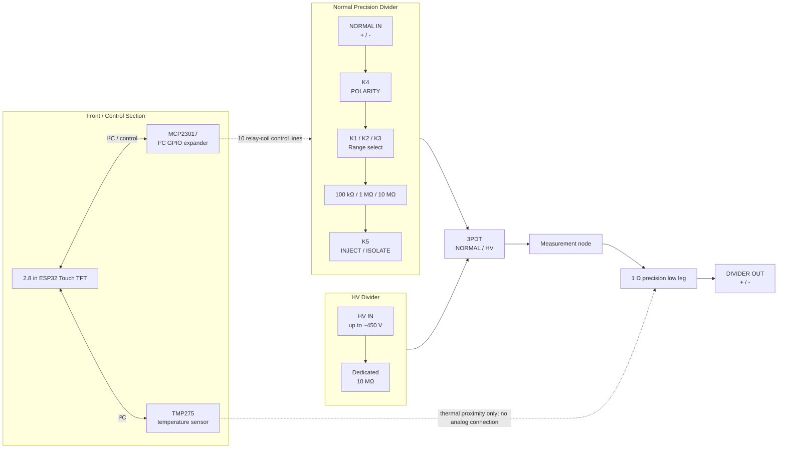

# Programmable Nanovolt Divider / Precision Attenuator
## Rev0 Design Specification

**Revision:** Rev0  
**Date:** 2026-09-06  
**Status:** Architecture locked; schematic and PCB layout next  
**Primary use:** calibrated low-level DC injection and sub-LSB metrology with an external precision DMM  
**Secondary use:** passive measurement of a ~450 V Geiger-counter power supply

---

## 1. Problem statement

The goal is to build a compact bench instrument that converts an ordinary, controllable DC source into a stable and calibrated nanovolt-to-microvolt signal by **passive resistive attenuation**, rather than attempting to synthesize nanovolts directly.

The motivating experiment used a LAN-controlled bench power supply, a simple ~1:10^6 divider built from inexpensive resistors, an HP 3478A 5½-digit DMM on its 30 mV range, and ABBA modulation/averaging. That setup demonstrated reliable recovery of signals well below the DMM's 100 nV quantization count, including signals around 20 nV.

The Rev0 instrument should preserve the simplicity of the successful experiment:

> **A conventional voltage source + passive precision attenuation + reversal + true zero + calibration + averaging.**

The precision signal path should remain as passive and electrically quiet as practical.

---

## 2. Planned capabilities

1. **Three programmable normal-input attenuation ranges**
   - approximately `1e-5`
   - approximately `1e-6`
   - approximately `1e-7`

2. **Shared 1 Ω low-leg resistor**
   - permanent part of the DMM measurement path
   - never switched out of the low-voltage path
   - serves as the "heart" of the divider

3. **Programmable polarity reversal**
   - implemented with a latching relay
   - reversal occurs upstream of the precision divider

4. **Programmable injection / isolation**
   - implemented with a latching relay upstream of the 1 Ω resistor
   - `INJECT`: selected source drives current through the 1 Ω resistor
   - `ISOLATE`: high-side source is disconnected while the DMM remains connected across the same 1 Ω resistor
   - provides a physically meaningful zero without perturbing the low-voltage measurement path

5. **Dedicated high-voltage input**
   - intended for a ~450 V Geiger-counter supply
   - fixed divider using a dedicated 10 MΩ high leg and the shared 1 Ω low leg
   - nominal attenuation approximately `1e-7`
   - selected by a **physical 3PDT NORMAL/HV toggle switch**
   - the HV path does **not** rely on the small TQ relays for switching 450 V

6. **Temperature monitoring**
   - one TMP275 located adjacent to the 1 Ω resistor
   - used to characterize thermal behavior and support optional ratio correction
   - SOIC-8, because the board is hand-soldered; the TMP117 it replaced is DSBGA-6 only
   - ±0.5 °C / 12-bit rather than the TMP117's ±0.1 °C / 16-bit. The correction is driven by the
     *change* in temperature since calibration, so short-term repeatability matters here and
     absolute accuracy does not.

7. **Stored calibration**
   - calibrated divider multiplier for each normal range
   - calibrated multiplier for the HV range
   - reference temperature
   - optional measured temperature coefficient for each range
   - calibration metadata stored in nonvolatile memory

8. **Local user interface**
   - integrated 2.8" ESP32 + 320×240 resistive-touch TFT module
   - touchscreen control of:
     - range
     - polarity
     - injection/isolation
   - physical 3PDT NORMAL/HV selector remains independent of firmware
   - display shows active mode, range, polarity, output state, calibrated factor, temperature, and communications status

9. **Remote control**
   - SCPI-style command interface over USB serial
   - SCPI-style command interface over Wi-Fi/TCP
   - USB and Wi-Fi use the same internal parser/state machine

---

## 3. Rev0 non-goals

Rev0 intentionally avoids becoming a general-purpose precision source or full HV instrument.

Not planned for Rev0:

- direct nanovolt generation with DACs/op-amps
- precision voltage reference
- closed-loop output regulation
- internal DMM/ADC as the metrology reference
- automatic PSU control inside the instrument
- programmable switching of the 450 V input with the TQ relays
- sub-nanovolt absolute-accuracy claims
- complex active analog circuitry in the precision signal path

The external PSU remains the voltage source; the external DMM remains the measurement reference.

---

## 4. Electrical architecture

### 4.1 Normal-input signal path

The normal input uses five identical dual-coil latching relay channels:

| Relay | Function |
|---|---|
| K1 | Select 100 kΩ high leg (`~1e-5`) |
| K2 | Select 1 MΩ high leg (`~1e-6`) |
| K3 | Select 10 MΩ high leg (`~1e-7`) |
| K4 | Polarity reversal |
| K5 | Injection enable / isolation |

Only one range relay is active at a time.

Nominal divider factors are:

\[
k = \frac{R_L}{R_H + R_L}
\]

with \(R_L = 1\ \Omega\).

| Range | High leg | Nominal factor |
|---|---:|---:|
| `1e-5` | 100 kΩ | 9.999900001e-6 |
| `1e-6` | 1 MΩ | 9.999990000e-7 |
| `1e-7` | 10 MΩ | 9.999999000e-8 |

Actual factors will be determined by calibration and stored in firmware.

### 4.2 Zero / isolation philosophy

The 1 Ω low-leg resistor is **never shorted and never removed from the DMM path**.

In `INJECT` mode:

```text
selected high leg -> injection node -> 1 Ω -> analog return
                                  |           |
                                DMM HI      DMM LO
```

In `ISOLATE` mode:

```text
selected high leg -> OPEN

                    injection node -> 1 Ω -> analog return
                         |                    |
                       DMM HI               DMM LO
```

This preserves the same 1 Ω resistor, PCB traces, solder joints, output connector, cable, and DMM terminals. Only the intentionally injected current is removed.

### 4.3 High-voltage path

The HV input is a separate passive path:

```text
HV IN + -> dedicated 10 MΩ high leg -> measurement node -> 1 Ω -> HV IN -
                                               |             |
                                             OUT HI        OUT LO
```

At 450 V:

- divider current is approximately 45 µA,
- output is approximately 45 µV,
- dissipation in the 10 MΩ resistor is approximately 20 mW.

The dedicated HV 10 MΩ resistor is planned to be the same Ohmite `SM102031005FE` used for the normal `1e-7` range.

A physical **3PDT toggle** selects NORMAL vs HV operation:

- two poles perform analog selection,
- the third pole reports NORMAL/HV state to the ESP32.

**Safety requirement:** the selected switch, banana sockets, wiring, PCB creepage, and clearances must be suitable for the intended 450 VDC service. The HV path should remain physically distinct from the low-voltage control section.

---

## 5. System block diagram



---

## 6. Control architecture

### 6.1 Controller

Rev0 uses an integrated **2.8" ESP32 touch-display module** rather than a separate Arduino + TFT.

Expected module characteristics:

- ESP32 MCU
- Wi-Fi
- USB serial interface
- 320×240 ILI9341 TFT
- resistive touchscreen / XPT2046-type controller

### 6.2 GPIO expansion

Five TQ2-L2 relays require ten coil-control outputs:

- 5 × SET
- 5 × RESET

An **MCP23017** I²C GPIO expander provides these outputs.

The ten MCP23017 outputs drive ten identical low-side transistor stages:

```text
MCP23017 GPIO
    |
   1 kΩ
    |
MMBT2222A base
    |
10 kΩ pulldown to DGND

relay coil -> MMBT2222A collector
MMBT2222A emitter -> DGND
1N4148W flyback diode across relay coil
```

The same I²C bus is used for the TMP275 (address 0x48, `A2`/`A1`/`A0` all on `DGND`).

### 6.3 Relay safety/state rules

1. Power-up into a deterministic safe state.
2. Establish `ISOLATE` before configuring other relay states.
3. Only one range relay may be active at a time.
4. Range changes use break-before-make.
5. Polarity changes occur while isolated.
6. Relay coils are pulsed only briefly; they are never continuously energized.
7. In HV mode, normal relay-based source controls are disabled or clearly marked unavailable.

---

## 7. Mechanical / thermal architecture

The enclosure should have two physically distinct regions.

### Control / warm / noisy region

- ESP32 + touchscreen
- Wi-Fi antenna
- MCP23017
- relay-driver electronics
- USB/power wiring

### Precision / quiet region

- relay contacts
- precision high-leg resistors
- 1 Ω resistor
- TMP275
- output connector
- HV divider components

A physical divider wall inside the enclosure is desirable for airflow isolation, thermal isolation, and wiring organization.

The enclosure should not be fully metallic because the ESP32 Wi-Fi antenna requires an RF-transparent path. A plastic-bodied instrument enclosure with a machinable metal front panel is preferred.

### 1 Ω thermal region

The 1 Ω resistor should receive special layout treatment:

- located near the output connector,
- minimal low-level trace length,
- output/sense traces branch directly from the resistor terminals,
- TMP275 placed nearby,
- no relay coil or TFT/backlight heat nearby,
- optional PCB cutouts/slots to reduce thermal conduction from the rest of the board.

---

## 8. Calibration model

Each range stores a calibration record:

```text
RangeCalibration
    range_id
    nominal_factor
    calibrated_factor_at_Tref
    reference_temperature
    measured_ratio_tempco
    calibration_timestamp
```

Temperature correction, once characterized, may use:

\[
k(T) = k_0 \left[1 + \alpha(T - T_0)\right]
\]

Rev0 firmware should support the field from the beginning but use **zero temperature correction until the coefficient is experimentally measured**.

---

## 9. Planned SCPI interface

Exact command names may evolve, but Rev0 should support these concepts:

```text
*IDN?
*RST?

:OUTP ON
:OUTP OFF
:OUTP?

:POL NORM
:POL INV
:POL?

:RANG 1E-5
:RANG 1E-6
:RANG 1E-7
:RANG?

:TEMP?

:CAL:RATIO?
:CAL:TC?
:CAL:TREF?

:SOUR:FACTOR?
:SYST:MODE?
```

USB serial and Wi-Fi/TCP should share the same parser and instrument state machine.

---

## 10. KiCad schematic organization

The schematic should be created **top-down**.

Recommended hierarchy:

```text
nanovolt-divider.kicad_sch        # root / system architecture
|
+-- control.kicad_sch
|     ESP32/display interface
|     MCP23017
|     TMP275 interface
|     power/decoupling
|
+-- relay_channel.kicad_sch       # same file instantiated 5 times
      K1 RANGE_1E5
      K2 RANGE_1E6
      K3 RANGE_1E7
      K4 POLARITY
      K5 INJECT
```

The root sheet owns the actual metrology topology:

- NORMAL input
- HV input
- 3PDT selector
- 100 kΩ / 1 MΩ / 10 MΩ divider network
- dedicated HV 10 MΩ leg
- 1 Ω low leg
- output terminals

`relay_channel.kicad_sch` should be generic and expose:

```text
SET
RESET

A_COM
A_NO
A_NC

B_COM
B_NO
B_NC
```

The same sheet is instantiated five times. KiCad's multi-channel/repeat-layout workflow can then duplicate the physical relay-driver layout after one channel is placed and routed.

---

## 11. BOM — Rev0

### 11.1 Precision / analog components

| Qty Rev0 | Part | Mfr. part number | Function / notes | Status |
|---:|---|---|---|---|
| 1 | Vishay/Dale 1 Ω wirewound | `RS02C1R000FE70` | Shared low leg, 1%, 2.5 W, through-hole | **Purchased** |
| 1 | Ohmite 100 kΩ metal film | `MOX70031003BZE` | Normal `1e-5` range, 0.1%, 5 ppm/°C | **Purchased** |
| 1 | Ohmite 1 MΩ metal film | `MOX70031004BYE` | Normal `1e-6` range, 0.1%, 10 ppm/°C | **Purchased** |
| 1 | Ohmite 10 MΩ thick film | `SM102031005FE` | Normal `1e-7` range, 1% | **Purchased** |
| 1 | Ohmite 10 MΩ thick film | `SM102031005FE` | Dedicated HV divider leg | **To order** |
| 5 | Panasonic latching relay | `TQ2-L2-5V-3` | K1–K5 | 1 purchased; **4 more required** |
| 1 | TI temperature sensor, SOIC-8 | `TMP275AIDR` | Temperature of 1 Ω region, I²C 0x48 | **To order** (the purchased `TMP117MAIYBGR` is DSBGA-6 and cannot be hand-soldered) |

### 11.2 Relay-driver / control-board components

| Qty Rev0 | Part | Mfr. part number | Function / notes | Status |
|---:|---|---|---|---|
| 10 | NPN transistor, SOT-23 | `MMBT2222A` | Two low-side coil drivers per relay | **12 purchased** |
| 10 | Switching diode | `1N4148W` | Flyback diode across each relay coil | **12 purchased** |
| 10 | 1 kΩ resistor, 1206 | existing stock/library | Transistor base resistor | On hand / source TBD |
| 10 | 10 kΩ resistor, 1206 | existing stock/library | Base pulldown | On hand / source TBD |
| 1 | MCP23017 | TBD | I²C GPIO expander for relay controls | **To order** |
| 1 | Integrated 2.8" ESP32 touch TFT | ELEGOO / ESP32 2.8" ILI9341-type module | UI, Wi-Fi, USB, controller | Planned / status TBD |
| 1 | 3PDT toggle switch | TBD | Physical NORMAL/HV selection; 450 VDC suitability required | **To select/order** |

### 11.3 Decoupling / power

| Qty Rev0 | Part | Mfr. part number | Function / notes | Status |
|---:|---|---|---|---|
| as needed | 100 nF, 16 V, X7R, SMD | `SH31B104K160CT` | Local high-frequency decoupling | **20 purchased** |
| 2–3 | 22 µF, 1206 MLCC | `EMK316BB7226ML-T` | Local/bulk 5 V decoupling | **3 purchased** |
| 2 | I²C pull-up resistors, 1206 | TBD | SDA/SCL pull-ups if required | On hand / TBD |

### 11.4 Front panel / mechanical

| Qty | Item | Notes | Status |
|---:|---|---|---|
| 2 | Normal-input banana sockets | + / − | To select |
| 2 | HV-input safety banana sockets | Prefer shrouded; appropriate for 450 VDC | To select |
| 2 | Output banana sockets | + / − | To select |
| 1 | Stock instrument enclosure | RF-transparent body preferred, machinable metal front panel | TBD |
| 1 | Internal compartment divider | Plastic / FR4 / 3D printed | To design |
| 1 | TFT mounting bezel | Optional 3D-printed bezel | To design |
| misc. | PCB standoffs, harnesses | Mechanical integration | TBD |
| - | *(no board-side harness headers)* | Display-module pigtails solder straight to `J7`/`J8`/`J9` pads | n/a |

---

## 12. First Mouser order

The first Mouser order establishes the core passive-divider and relay-driver component set:

- 1 Ω low-leg resistor
- 100 kΩ, 1 MΩ, and 10 MΩ divider resistors
- 12 × MMBT2222A
- 12 × 1N4148W
- 20 × 100 nF X7R MLCCs
- 3 × 1206 bulk MLCCs
- 1 × TMP117 *(DSBGA-6, superseded - see 11.1)*
- 1 × TQ2-L2-5V-3 relay

Additional Rev0 procurement is expected to include:

- four more TQ2-L2-5V-3 relays,
- one `TMP275AIDR` (SOIC-8) in place of the DSBGA-6 TMP117,
- one additional `SM102031005FE` 10 MΩ resistor for the HV leg,
- MCP23017,
- HV-rated 3PDT selector,
- banana sockets,
- enclosure/mechanical hardware.

---

## 13. Rev0 design principles

1. **Do not synthesize nanovolts directly.** Generate ordinary voltages well and attenuate them.
2. **Keep the precision signal path passive.**
3. **Nothing switches below the 1 Ω measurement node.**
4. **A zero measurement should preserve the same low-voltage path.**
5. **Use latching relays so coil power and heating vanish during measurement.**
6. **Separate digital/warm electronics physically from the precision divider.**
7. **Calibrate actual ratios; do not depend on nominal resistor tolerance.**
8. **Measure temperature before attempting temperature correction.**
9. **Keep the 450 V path physically and electrically distinct from the small-relay network.**
10. **Favor simple, inspectable circuitry over unnecessary analog sophistication.**

---

## 14. Immediate next steps

1. Create the KiCad project and project-local symbol/footprint libraries.
2. Draw the Rev0 root-sheet architecture first.
3. Create the generic `relay_channel.kicad_sch` interface.
4. Instantiate the relay channel five times.
5. Implement and ERC-check one relay channel.
6. Build the control sheet around the ESP32 module, MCP23017, and TMP275.
7. Complete the precision/HV signal path on the root sheet.
8. Select the HV-rated 3PDT switch and safety banana sockets.
9. Assign real footprints from component datasheets.
10. Perform a schematic architecture/safety review before starting PCB placement.
