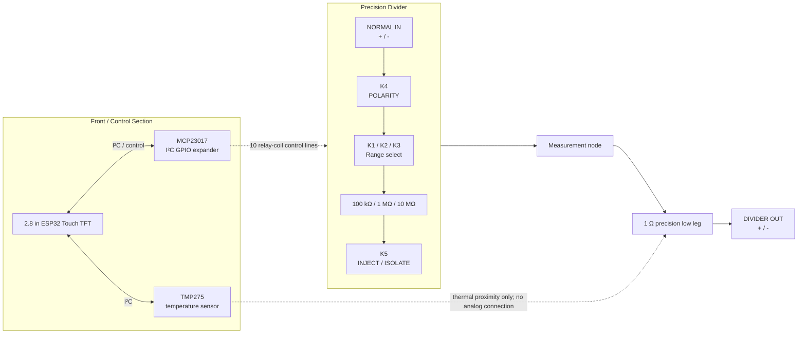

# Programmable Nanovolt Divider / Precision Attenuator
## Rev A design

**Revision:** Rev A, as built (fab files in `hardware/fab/`, enclosure in `enclosure/`)  
**Primary use:** calibrated low-level DC injection and sub-LSB metrology with an external precision DMM

---

## 1. Purpose

The instrument converts an ordinary, controllable DC source into a stable and calibrated
nanovolt-to-microvolt signal by **passive resistive attenuation**, rather than synthesizing nanovolts
directly.

The method it supports is a LAN- or USB-controlled bench supply, a ~1:10^n divider, a 5½-digit DMM on
its most sensitive range, and ABBA modulation with averaging. With an HP 3478A on its 30 mV range,
that combination recovers signals well below the meter's 100 nV quantization step, down to tens of
nanovolts.

> **A conventional voltage source + passive precision attenuation + reversal + source-disconnected baseline + calibration + averaging.**

The precision signal path is kept as passive and electrically quiet as practical.

---

## 2. Capabilities

1. **Three programmable attenuation ranges**
   - approximately `1e-5`
   - approximately `1e-6`
   - approximately `1e-7`

2. **Shared 1 Ω low-leg resistor**
   - permanent part of the DMM measurement path
   - never switched out of the low-voltage path
   - the "heart" of the divider

3. **Programmable polarity reversal**
   - a latching relay
   - reversal occurs upstream of the precision divider

4. **Programmable injection / isolation**
   - a latching relay upstream of the 1 Ω resistor
   - `INJECT`: the source drives current through the 1 Ω resistor
   - `ISOLATE`: the source is disconnected at both ends while the DMM remains connected across the same 1 Ω resistor
   - a physically meaningful zero that does not perturb the low-voltage measurement path

5. **Temperature monitoring**
   - one TMP275 adjacent to the 1 Ω resistor
   - drives the stored temperature correction of the ratio
   - the correction depends on the *change* in temperature since calibration, so short-term repeatability
     (12-bit, 0.0625 °C) matters and absolute accuracy (±0.5 °C) does not

6. **Stored calibration**
   - per range: calibrated ratio, reference temperature, temperature coefficients, uncertainties, valid temperature span
   - stored in nonvolatile memory, backed up and audit-logged on microSD

7. **Local user interface**
   - integrated 2.8" ESP32 + 320×240 resistive-touch TFT module
   - touchscreen control of range, polarity and injection/isolation
   - the display shows range, polarity, output state, calibrated factor, temperature and status

8. **Remote control**
   - SCPI over USB serial. There is no wireless interface: the radio is never initialised.

---

## 3. Non-goals

The instrument is deliberately not a general-purpose precision source:

- no direct nanovolt generation with DACs/op-amps
- no precision voltage reference
- no closed-loop output regulation
- no internal DMM/ADC as the metrology reference
- no control of the external supply
- no sub-nanovolt absolute-accuracy claims
- no active analog circuitry in the precision signal path

The external supply is the voltage source; the external DMM is the measurement reference.

---

## 4. Electrical architecture

### 4.1 Signal path

Five identical dual-coil latching relay channels:

| Relay | Function |
|---|---|
| K1 | Select 100 kΩ high leg (`~1e-5`) |
| K2 | Select 1 MΩ high leg (`~1e-6`) |
| K3 | Select 10 MΩ high leg (`~1e-7`) |
| K4 | Polarity reversal |
| K5 | Injection enable / isolation |

Only one range relay is active at a time.

Nominal divider factors are

\[
k = \frac{R_L}{R_H + R_L}
\]

with \(R_L = 1\ \Omega\):

| Range | High leg | Nominal factor |
|---|---:|---:|
| `1e-5` | 100 kΩ | 9.999900001e-6 |
| `1e-6` | 1 MΩ | 9.999990000e-7 |
| `1e-7` | 10 MΩ | 9.999999000e-8 |

Actual factors are determined by calibration and stored in the instrument ([calibration.md](calibration.md)).

### 4.2 Zero / isolation

The 1 Ω low-leg resistor is **never shorted and never removed from the DMM path**.

In `INJECT` mode:

```text
selected high leg -> injection node -> 1 Ω -> analog return
                                  |           |
                                DMM HI      DMM LO
```

In `ISOLATE` mode:

```text
selected high leg -> OPEN

                    injection node -> 1 Ω -> analog return
                         |                    |
                       DMM HI               DMM LO
```

The zero therefore keeps the same 1 Ω resistor, PCB traces, solder joints, output connector, cable and
DMM terminals. Only the injected current is removed.

---

## 5. System block diagram



---

## 6. Control architecture

### 6.1 Controller

An integrated **2.8" ESP32 touch-display module**, a "Cheap Yellow Display" (ESP32-2432S028R
family): ESP32, CH340 USB serial, 320×240 ILI9341 TFT, XPT2046-type resistive touch, microSD slot.

Its three 4-pin connectors are UART / power (RXD, TXD, GND, 5V), 3V3 (3.3V, IO35, nc, GND) and SPI
(IO23 MOSI, IO19 MISO, IO18 SCK, IO27 CS). The board takes 5 V and GND from the first, 3.3 V and GND
from the second, and the I²C bus from the third: **SDA = IO27, SCL = IO18**. The pad-by-pad wiring is
in [hardware.md, "Display harness"](hardware.md#display-harness).

### 6.2 GPIO expansion

Five TQ2-L2 relays need ten coil-control outputs (5 × SET, 5 × RESET), provided by an **MCP23017**
I²C GPIO expander. Each output drives an identical low-side transistor stage:

```text
MCP23017 GPIO
    |
   1 kΩ
    |
MMBT2222A base
    |
10 kΩ pulldown to DGND

relay coil -> MMBT2222A collector
MMBT2222A emitter -> DGND
1N4148W flyback diode across relay coil
```

The same I²C bus carries the TMP275 (address 0x48, `A2`/`A1`/`A0` all on `DGND`).

### 6.3 Relay safety/state rules

1. Power up into a deterministic safe state.
2. Establish `ISOLATE` before configuring other relay states.
3. Only one range relay may be active at a time.
4. Range changes use break-before-make.
5. Polarity changes occur while isolated.
6. Relay coils are pulsed only briefly; they are never continuously energized.

The firmware enforces all six; see `firmware/README.md`.

---

## 7. Mechanical / thermal architecture

The enclosure has two physically distinct regions.

### Control / warm / noisy region

- ESP32 + touchscreen
- MCP23017
- relay-driver electronics
- USB/power wiring

### Precision / quiet region

- relay contacts
- precision high-leg resistors
- 1 Ω resistor
- TMP275
- output connector

The enclosure is 3D-printed plastic, with the front panel doubling as the display bezel.

### 1 Ω thermal region

The 1 Ω resistor gets special layout treatment:

- near the output connector,
- minimal low-level trace length,
- output/sense traces branch directly from the resistor terminals (Kelvin),
- TMP275 alongside,
- no relay coil or TFT/backlight heat nearby,
- PCB slots that leave the resistor on an island joined by narrow bridges, to reduce thermal
  conduction from the rest of the board.

---

## 8. Calibration model

Each range stores a record:

```text
k(T) = k0 [1 + α(T − T0) + β(T − T0)²]
u(T) = sqrt(u_k0² + (u_α (T − T0))²)          (ppm, k = 1)
```

with T the TMP275 reading on the 1 Ω island, valid over the span [Tmin, Tmax] it was measured over,
plus a date and a provenance string. The instrument answers "the ratio at this board temperature"
directly (`CAL:FACT? <range>,<T>` → k, uncertainty, in-span flag). Every saved calibration is
appended to an audit trail on the SD card. Before calibration the records are nominal, with
tolerance-sized uncertainties. How the records are measured is in [calibration.md](calibration.md).

---

## 9. SCPI interface

SCPI over USB serial, 115200 8N1. The core commands:

```text
*IDN?  *RST  *OPC?  SYST:ERR?
OUTP ON|OFF         INJECT / ISOLATE
POL NORM|INV
RANG 1E-5|1E-6|1E-7|NONE
TEMP?
SOUR:FACT?          calibrated factor of the active range
CAL:FACT? <range>[,<T>]
CAL:REC <range>,...  /  CAL:REC? <range>
SYST:MODE?          whole state in one line
```

The full command reference is in `firmware/README.md`; what a host program relies on (error queue,
completion, timing, reset detection) is in [host_interface.md](host_interface.md).

---

## 10. KiCad schematic organization

The schematic is hierarchical:

```text
nanovolt-divider.kicad_sch        # root / system architecture
|
+-- control.kicad_sch
|     ESP32/display interface
|     MCP23017
|     TMP275 interface
|     power/decoupling
|
+-- relay_channel.kicad_sch       # same file instantiated 5 times
      K1 RANGE_1E5
      K2 RANGE_1E6
      K3 RANGE_1E7
      K4 POLARITY
      K5 INJECT
```

The root sheet owns the metrology topology:

- the input
- the 100 kΩ / 1 MΩ / 10 MΩ divider network
- the 1 Ω low leg
- the output terminals

`relay_channel.kicad_sch` is generic and exposes:

```text
SET
RESET

A_COM
A_NO
A_NC

B_COM
B_NO
B_NC
```

Because all five channels share one sheet, KiCad's multichannel / repeat-layout tooling can replicate
the driver layout after one channel is placed and routed.

---

## 11. BOM

### 11.1 Precision / analog components

| Qty | Part | Mfr. part number | Function / notes |
|---:|---|---|---|
| 1 | Vishay/Dale 1 Ω wirewound | `RS02C1R000FE70` | Shared low leg, 1%, 2.5 W, through-hole |
| 1 | Ohmite 100 kΩ metal film | `MOX70031003BZE` | `1e-5` range, 0.1%, 5 ppm/°C |
| 1 | Ohmite 1 MΩ metal film | `MOX70031004BYE` | `1e-6` range, 0.1%, 10 ppm/°C |
| 1 | Ohmite 10 MΩ thick film | `SM102031005FE` | `1e-7` range, 1% |
| 5 | Panasonic latching relay | `TQ2-L2-5V-3` | K1–K5 |
| 1 | TI temperature sensor, SOIC-8 | `TMP275AIDR` | Temperature of the 1 Ω region, I²C 0x48 |

### 11.2 Relay-driver / control components

| Qty | Part | Mfr. part number | Function / notes |
|---:|---|---|---|
| 10 | NPN transistor, SOT-23 | `MMBT2222A` | Two low-side coil drivers per relay |
| 10 | Switching diode | `1N4148W` | Flyback diode across each relay coil |
| 10 | 1 kΩ resistor, 1206 | any 1% 1206 (e.g. [1206 chip-resistor kit, 0R–10M, 72 values](https://www.amazon.com/dp/B0DF74GXKL)) | Transistor base resistor |
| 11 | 10 kΩ resistor, 1206 | any 1% 1206 | Base pulldowns (10), MCP23017 `~RESET` pull-up R23 (1) |
| 1 | Microchip MCP23017, SOIC-28 | `MCP23017-E/SO` | I²C GPIO expander for relay controls, 0x20 |
| 1 | Integrated 2.8" ESP32 touch TFT | "Cheap Yellow Display", ESP32-2432S028R family, e.g. [ELEGOO ESP32 2.8" touch display, 240×320 ILI9341, USB-C](https://www.amazon.com/dp/B0FJQ6RK39) | UI, USB, controller |

### 11.3 Decoupling / power

| Qty | Part | Mfr. part number | Function / notes |
|---:|---|---|---|
| 2 | 100 nF, 16 V, X7R, SMD | `SH31B104K160CT` | Decoupling at the MCP23017 (C1) and the TMP275 (C2) |
| 2 | 22 µF, 1206 MLCC | `EMK316BB7226ML-T` | Bulk decoupling at the power entry (C3, C4) |
| 2 | 4.7 kΩ resistor, 1206 | any 1% 1206 | SDA/SCL pull-ups to 3V3 |

### 11.4 Front panel / mechanical

| Qty | Item | Notes |
|---:|---|---|
| 4 | Female banana jacks, 2 red + 2 black | NORMAL IN + / − and OUT + / −. e.g. [Amazon B07C7WG23G](https://www.amazon.com/dp/B07C7WG23G) |
| 1 | Enclosure | 3D-printed: front panel, back panel, base plate, cover, PCB holder (SOLIDWORKS, STEP and 3MF in `enclosure/`). The front panel also serves as the TFT bezel. Print settings: see the README |
| 1 | Banana-jack nut wrench | 3D-printed tool (`enclosure/banana-plug-wrench-v0`) for the banana-jack nuts |
| 3 | JST 1.25 mm 4-pin male plug, 100 mm pigtail, 26 AWG | Display-module harnesses. e.g. [Amazon B0DMT2GBZH](https://www.amazon.com/dp/B0DMT2GBZH) |
| 1 | 1 ft USB-to-USB extension cable | Brings the module's USB out to the back panel. e.g. [Amazon B0GRVZ62VR](https://www.amazon.com/dp/B0GRVZ62VR) |

The display-module pigtails solder straight to the `J7`/`J8` pads; there are no board-side headers.

### 11.5 Fasteners

| Qty | Item | Use |
|---:|---|---|
| 4 | M2×4 machine screw | PCB to PCB holder |
| 4 | M2 flat washer | PCB to PCB holder |
| 4 | M2×4×3.2 knurled brass heat-set insert | Heat-set into the PCB holder, takes the PCB screws |
| 4 | M3×6 button-head socket screw | Display module (CYD) mounting |
| 4 | M3 nut | Display module (CYD) mounting |
| 14 | M3×8 button-head socket screw | Enclosure assembly |
| 14 | M3×4×4.2 knurled brass heat-set insert | Heat-set into the printed enclosure parts, take the assembly screws |
| 2 | M2×12 machine screw | USB extension cable mount |
| 2 | M2 flat washer | USB extension cable mount |
| 2 | M2 nut | USB extension cable mount |

Totals: M2×4 screws ×4, M2×12 screws ×2, M2 washers ×6, M2 nuts ×2, M2×4×3.2 inserts ×4;
M3×6 button-head ×4, M3×8 button-head ×14, M3 nuts ×4, M3×4×4.2 inserts ×14.

---

## 12. Design principles

1. **Do not synthesize nanovolts directly.** Generate ordinary voltages well and attenuate them.
2. **Keep the precision signal path passive.**
3. **Nothing switches below the 1 Ω measurement node.**
4. **A zero measurement preserves the same low-voltage path.**
5. **Use latching relays so coil power and heating vanish during measurement.**
6. **Separate digital/warm electronics physically from the precision divider.**
7. **Calibrate actual ratios; do not depend on nominal resistor tolerance.**
8. **Measure temperature before attempting temperature correction.**
9. **Favor simple, inspectable circuitry over unnecessary analog sophistication.**
10. **Keep the instrument single-purpose.** A capability that has to share the 1 Ω low leg inherits its
    constraints; if those make it a poor version of the thing, it belongs in its own box.
